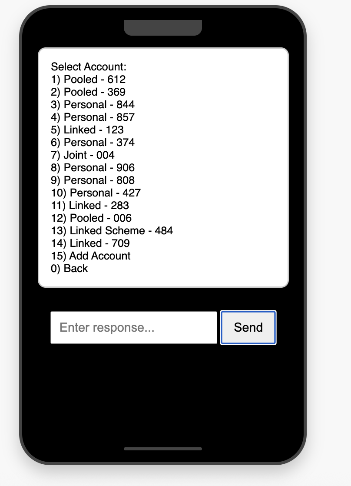

# XENO USSD Simulator

A web-based simulator for testing USSD applications and services. This tool allows developers to interact with USSD services without needing a physical device or telecom connection.



## Features

- Simulates USSD sessions in a phone-like interface
- Supports custom session IDs and phone numbers
- Works with any USSD service code
- Real-time interaction with USSD endpoints
- Simple and intuitive user interface
- Detailed console logging for debugging

## Installation

### Prerequisites

- Web server (Apache, Nginx, or any static file server)
- Access to the USSD backend service

### Setup

1. Clone this repository:
   ```
   git clone git@github.com:kakavi/ussd-simulator.git
   ```

2. Navigate to the project directory:
   ```
   cd ussd-simulator
   ```

3. Open `index.html` in a text editor and update the `baseUrl` variable (line 98) to point to your USSD service:
   ```javascript
   let baseUrl = 'http://your-ussd-service-url';
   ```

4. Deploy to your web server or open the file directly in a browser.

## Usage

1. Open the simulator in your web browser
2. Enter your phone number
3. Enter the USSD service code you want to test (default is `*165*5*7#`)
4. Click "Start USSD Session"
5. Interact with the USSD service by entering responses in the input field
6. View the USSD responses in the display area

## API Integration

The simulator makes POST requests to your USSD service with the following parameters:

- `sessionId`: A unique identifier for the USSD session
- `phoneNumber`: The phone number initiating the request
- `serviceCode`: The USSD code being dialed
- `text`: The user's input (empty for initial requests)

Example endpoint:
```
POST /api/v1/ussd/menu?sessionId={sessionId}&phoneNumber={phoneNumber}&serviceCode={serviceCode}&text={text}
```

## Configuration

You can modify the following settings in the `index.html` file:

- `baseUrl` (line 98): The base URL of your USSD service
- Default service code (line 116): Change the default USSD code

## Contributing

Contributions are welcome! Please feel free to submit a Pull Request.

1. Fork the repository
2. Create your feature branch (`git checkout -b feature/amazing-feature`)
3. Commit your changes (`git commit -m 'Add some amazing feature'`)
4. Push to the branch (`git push origin feature/amazing-feature`)
5. Open a Pull Request

## License

This project is licensed under the MIT License - see the [LICENSE](LICENSE) file for details.

## Acknowledgements

- All contributors who participate in this project
